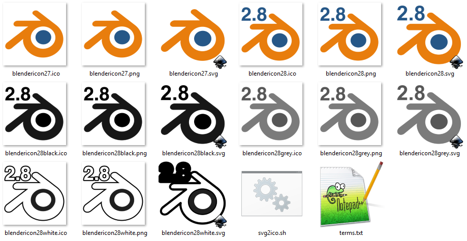

Fresh Blender icons - because over the years of frustrating early learning, the painful experiences always started with looking at the orange, blue and white. We still see it today, even though the tool has changed greatly and even though we have grown and learned. Perhaps we no not want to be reminded of the pain of our youth? All it takes is modifying the shape and/or color of the thing you click to start the tool.

Demo + installation (can be tricky as &@#*(&@ on Windows): https://www.youtube.com/watch?v=jAbFAnD98gQ

